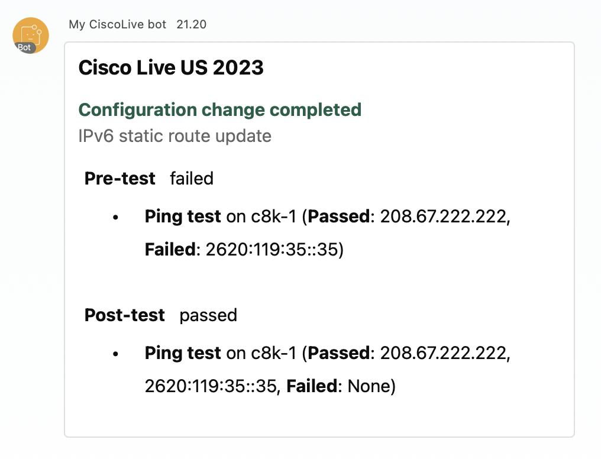

# Scripts for Chapter 4

All the scripts have been tested against the DevNet reservable sandbox on May 2023: **[IOS XE on Cat 8kv Latest Code](https://devnetsandbox.cisco.com/RM/Diagram/Index/a5823504-3391-47cc-93a4-8bcadc701839?diagramType=Topology)** (Requires login with DevNet credentials)

**Note that due to the limitations of the Sandbox, the ping test against the DevNet sandbox will not be successful even after the configuration change.**

In this chapter we bring together all the learned from earlier. In the end you will have a "pipeline" Python file, that will first run a test, then configure the devices, and then run the test again.

## Source of truth

All the details for configurations and tests can be found from the folder `source_of_truth`.

- `template.j2` - Jinja2 template for the IPv6 static route payload
- `configuration.yaml` - list of routes to be included in the template
- `devices.yaml` - connection details for the network devices
- `test_config.yaml` - details for the tests - in this case the IP addresses to be targeted with the Ping test

## Helper functions

The functions to read YAML files, as well a to dynamically create a pyATS testbed from devices.yaml can be found from `helper_functions.py`.

Why create testbed dynamically in Python? If your source of truth is not a YAML file, but for example Cisco DNA Center or NetBox, creating a static testbed will add another resource that will need to be kept up to date. It is much more scalable to generate the testbed from the one source of truth. Therefor the logic created in this example serves as an example for you to use if you decide to use some other source of truth than a YAML file. 

## Tests

Testcases are stored in `testcases` folder. In this example there is only one testcase `ping_test.py`, however you could include more tests to verify for example the SLA of the services that are reachable through your network device.

Instead of running the Ping test directly, you call the test in your main script (read more below).

## RESTCONF

 `review_static_routes.py` uses RESTCONF to retrieve IPv6 static routes, and `update_static_routes.py` will update them. These two both work as standalone scripts utilizing the details found from `source_of_truth` folder, but they can also be called from other scripts (read more below).

## Webex integration

In real life, you wouldn't want to be staring at CLI when automation is being applied. A good idea is to send the relevant information to some external service - such as Cisco Webex. In this chapter, there is a Webex function in the folder `webex` that is being used in the `main.py` script to send the final summary to Webex.

If you want to use the Webex script, update values into `webex/webex_config.py` to match to your own details - a bot token and an the email to which the message should be sent. Set the `send_webex_message` value to `True` - this will include the Webex functionality to the flow. The Webex automation is out of scope in this technical seminar, however I am happy to sit down to discuss the Webex APIs outside of this seminar.



 ## The entry point: `main.py`

 The entrypoint to the "pipeline" is the `main.py`. When talking about a pipeline, your mind would run into different tools such as Jenkins or GitLab CI. In reality, a pipeline is just a group of tasks linked together in a logical way. A good tool will help you make a good, scalable and feature rich pipeline, but to understand the logic of linking tasks together, a simple Python file is a good way to start. When the logic of a pipeline is clear, it is easier to start implementing it into the tool of your choice.

The `main.py` is quite well commented, this will hopefully help you understand the flow.
Example of running the script:
```bash
$ python main.py

**********
Starting the pre-test...
2023-05-29T21:19:33: %AETEST-INFO: +------------------------------------------------------------------------------+
2023-05-29T21:19:33: %AETEST-INFO: |                            Starting common setup                             |
2023-05-29T21:19:33: %AETEST-INFO: +------------------------------------------------------------------------------+
2023-05-29T21:19:33: %AETEST-INFO: +------------------------------------------------------------------------------+
2023-05-29T21:19:33: %AETEST-INFO: |                         Starting subsection connect                          |
2023-05-29T21:19:33: %AETEST-INFO: +------------------------------------------------------------------------------+
2023-05-29T21:19:41: %AETEST-INFO: The result of subsection connect is => PASSED
2023-05-29T21:19:41: %AETEST-INFO: +------------------------------------------------------------------------------+
2023-05-29T21:19:41: %AETEST-INFO: |                  Starting subsection mark_tests_for_looping                  |
2023-05-29T21:19:41: %AETEST-INFO: +------------------------------------------------------------------------------+
2023-05-29T21:19:41: %AETEST-INFO: The result of subsection mark_tests_for_looping is => PASSED
2023-05-29T21:19:41: %AETEST-INFO: The result of common setup is => PASSED
2023-05-29T21:19:41: %AETEST-INFO: +------------------------------------------------------------------------------+
2023-05-29T21:19:41: %AETEST-INFO: |             Starting testcase PingTestcase[device=Device_c8k-1]              |
2023-05-29T21:19:41: %AETEST-INFO: +------------------------------------------------------------------------------+
2023-05-29T21:19:41: %AETEST-INFO: +------------------------------------------------------------------------------+
2023-05-29T21:19:41: %AETEST-INFO: |                            Starting section ping                             |
2023-05-29T21:19:41: %AETEST-INFO: +------------------------------------------------------------------------------+
2023-05-29T21:19:41: %AETEST-INFO: +..............................................................................+
2023-05-29T21:19:41: %AETEST-INFO: :         Starting STEP 1: Checking Ping from c8k-1 to 208.67.222.222          :
2023-05-29T21:19:41: %AETEST-INFO: +..............................................................................+
2023-05-29T21:19:42: %AETEST-INFO: Passed reason: Ping 208.67.222.222 from device c8k-1 successful
2023-05-29T21:19:42: %AETEST-INFO: The result of STEP 1: Checking Ping from c8k-1 to 208.67.222.222 is => PASSED
2023-05-29T21:19:42: %AETEST-INFO: +..............................................................................+
2023-05-29T21:19:42: %AETEST-INFO: :         Starting STEP 2: Checking Ping from c8k-1 to 2620:119:35::35         :
2023-05-29T21:19:42: %AETEST-INFO: +..............................................................................+
2023-05-29T21:19:42: %AETEST-ERROR: Failed reason: Ping 2620:119:35::35 from device c8k-1 unsuccessful
2023-05-29T21:19:42: %AETEST-INFO: The result of STEP 2: Checking Ping from c8k-1 to 2620:119:35::35 is => FAILED
2023-05-29T21:19:42: %AETEST-INFO: +..........................................................+
2023-05-29T21:19:42: %AETEST-INFO: :                       STEPS Report                       :
2023-05-29T21:19:42: %AETEST-INFO: +..........................................................+
2023-05-29T21:19:42: %AETEST-INFO: STEP 1 - Checking Ping from c8k-1 to 208.67.222.222Passed    
2023-05-29T21:19:42: %AETEST-INFO: STEP 2 - Checking Ping from c8k-1 to 2620:119:35::35Failed    
2023-05-29T21:19:42: %AETEST-INFO: ............................................................
2023-05-29T21:19:42: %AETEST-INFO: The result of section ping is => FAILED
2023-05-29T21:19:42: %AETEST-INFO: The result of testcase PingTestcase[device=Device_c8k-1] is => FAILED
2023-05-29T21:19:42: %AETEST-INFO: +------------------------------------------------------------------------------+
2023-05-29T21:19:42: %AETEST-INFO: |                           Starting common cleanup                            |
2023-05-29T21:19:42: %AETEST-INFO: +------------------------------------------------------------------------------+
2023-05-29T21:19:42: %AETEST-INFO: +------------------------------------------------------------------------------+
2023-05-29T21:19:42: %AETEST-INFO: |                        Starting subsection disconnect                        |
2023-05-29T21:19:42: %AETEST-INFO: +------------------------------------------------------------------------------+
2023-05-29T21:19:53: %AETEST-INFO: The result of subsection disconnect is => PASSED
2023-05-29T21:19:53: %AETEST-INFO: The result of common cleanup is => PASSED
2023-05-29T21:19:53: %AETEST-INFO: +------------------------------------------------------------------------------+
2023-05-29T21:19:53: %AETEST-INFO: |                               Detailed Results                               |
2023-05-29T21:19:53: %AETEST-INFO: +------------------------------------------------------------------------------+
2023-05-29T21:19:53: %AETEST-INFO:  SECTIONS/TESTCASES                                                      RESULT   
2023-05-29T21:19:53: %AETEST-INFO: --------------------------------------------------------------------------------
2023-05-29T21:19:53: %AETEST-INFO: .
2023-05-29T21:19:53: %AETEST-INFO: |-- common_setup                                                          PASSED
2023-05-29T21:19:53: %AETEST-INFO: |   |-- connect                                                           PASSED
2023-05-29T21:19:53: %AETEST-INFO: |   `-- mark_tests_for_looping                                            PASSED
2023-05-29T21:19:53: %AETEST-INFO: |-- PingTestcase[device=Device_c8k-1]                                     FAILED
2023-05-29T21:19:53: %AETEST-INFO: |   `-- ping                                                              FAILED
2023-05-29T21:19:53: %AETEST-INFO: |       |-- Step 1: Checking Ping from c8k-1 to 208.67.222.222            PASSED
2023-05-29T21:19:53: %AETEST-INFO: |       `-- Step 2: Checking Ping from c8k-1 to 2620:119:35::35           FAILED
2023-05-29T21:19:53: %AETEST-INFO: `-- common_cleanup                                                        PASSED
2023-05-29T21:19:53: %AETEST-INFO:     `-- disconnect                                                        PASSED
2023-05-29T21:19:53: %AETEST-INFO: +------------------------------------------------------------------------------+
2023-05-29T21:19:53: %AETEST-INFO: |                                   Summary                                    |
2023-05-29T21:19:53: %AETEST-INFO: +------------------------------------------------------------------------------+
2023-05-29T21:19:53: %AETEST-INFO:  Number of ABORTED                                                            0 
2023-05-29T21:19:53: %AETEST-INFO:  Number of BLOCKED                                                            0 
2023-05-29T21:19:53: %AETEST-INFO:  Number of ERRORED                                                            0 
2023-05-29T21:19:53: %AETEST-INFO:  Number of FAILED                                                             1 
2023-05-29T21:19:53: %AETEST-INFO:  Number of PASSED                                                             2 
2023-05-29T21:19:53: %AETEST-INFO:  Number of PASSX                                                              0 
2023-05-29T21:19:53: %AETEST-INFO:  Number of SKIPPED                                                            0 
2023-05-29T21:19:53: %AETEST-INFO:  Total Number                                                                 3 
2023-05-29T21:19:53: %AETEST-INFO:  Success Rate                                                             66.7% 
2023-05-29T21:19:53: %AETEST-INFO: --------------------------------------------------------------------------------

**********
Starting the configuration change...
Creating configuration from source_of_truth/template.j2 and source_of_truth/configuration.yaml... Payload created!
Configuring routes on c8k-1.juulia.pants.org... Success!

**********
Starting the post-test...
2023-05-29T21:19:54: %AETEST-INFO: +------------------------------------------------------------------------------+
2023-05-29T21:19:54: %AETEST-INFO: |                            Starting common setup                             |
2023-05-29T21:19:54: %AETEST-INFO: +------------------------------------------------------------------------------+
2023-05-29T21:19:54: %AETEST-INFO: +------------------------------------------------------------------------------+
2023-05-29T21:19:54: %AETEST-INFO: |                         Starting subsection connect                          |
2023-05-29T21:19:54: %AETEST-INFO: +------------------------------------------------------------------------------+
2023-05-29T21:20:02: %AETEST-INFO: The result of subsection connect is => PASSED
2023-05-29T21:20:02: %AETEST-INFO: +------------------------------------------------------------------------------+
2023-05-29T21:20:02: %AETEST-INFO: |                  Starting subsection mark_tests_for_looping                  |
2023-05-29T21:20:02: %AETEST-INFO: +------------------------------------------------------------------------------+
2023-05-29T21:20:02: %AETEST-INFO: The result of subsection mark_tests_for_looping is => PASSED
2023-05-29T21:20:02: %AETEST-INFO: The result of common setup is => PASSED
2023-05-29T21:20:02: %AETEST-INFO: +------------------------------------------------------------------------------+
2023-05-29T21:20:02: %AETEST-INFO: |             Starting testcase PingTestcase[device=Device_c8k-1]              |
2023-05-29T21:20:02: %AETEST-INFO: +------------------------------------------------------------------------------+
2023-05-29T21:20:02: %AETEST-INFO: +------------------------------------------------------------------------------+
2023-05-29T21:20:02: %AETEST-INFO: |                            Starting section ping                             |
2023-05-29T21:20:02: %AETEST-INFO: +------------------------------------------------------------------------------+
2023-05-29T21:20:02: %AETEST-INFO: +..............................................................................+
2023-05-29T21:20:02: %AETEST-INFO: :         Starting STEP 1: Checking Ping from c8k-1 to 208.67.222.222          :
2023-05-29T21:20:02: %AETEST-INFO: +..............................................................................+
2023-05-29T21:20:03: %AETEST-INFO: Passed reason: Ping 208.67.222.222 from device c8k-1 successful
2023-05-29T21:20:03: %AETEST-INFO: The result of STEP 1: Checking Ping from c8k-1 to 208.67.222.222 is => PASSED
2023-05-29T21:20:03: %AETEST-INFO: +..............................................................................+
2023-05-29T21:20:03: %AETEST-INFO: :         Starting STEP 2: Checking Ping from c8k-1 to 2620:119:35::35         :
2023-05-29T21:20:03: %AETEST-INFO: +..............................................................................+
2023-05-29T21:20:04: %AETEST-INFO: Passed reason: Ping 2620:119:35::35 from device c8k-1 successful
2023-05-29T21:20:04: %AETEST-INFO: The result of STEP 2: Checking Ping from c8k-1 to 2620:119:35::35 is => PASSED
2023-05-29T21:20:04: %AETEST-INFO: +..........................................................+
2023-05-29T21:20:04: %AETEST-INFO: :                       STEPS Report                       :
2023-05-29T21:20:04: %AETEST-INFO: +..........................................................+
2023-05-29T21:20:04: %AETEST-INFO: STEP 1 - Checking Ping from c8k-1 to 208.67.222.222Passed    
2023-05-29T21:20:04: %AETEST-INFO: STEP 2 - Checking Ping from c8k-1 to 2620:119:35::35Passed    
2023-05-29T21:20:04: %AETEST-INFO: ............................................................
2023-05-29T21:20:04: %AETEST-INFO: The result of section ping is => PASSED
2023-05-29T21:20:04: %AETEST-INFO: The result of testcase PingTestcase[device=Device_c8k-1] is => PASSED
2023-05-29T21:20:04: %AETEST-INFO: +------------------------------------------------------------------------------+
2023-05-29T21:20:04: %AETEST-INFO: |                           Starting common cleanup                            |
2023-05-29T21:20:04: %AETEST-INFO: +------------------------------------------------------------------------------+
2023-05-29T21:20:04: %AETEST-INFO: +------------------------------------------------------------------------------+
2023-05-29T21:20:04: %AETEST-INFO: |                        Starting subsection disconnect                        |
2023-05-29T21:20:04: %AETEST-INFO: +------------------------------------------------------------------------------+
2023-05-29T21:20:15: %AETEST-INFO: The result of subsection disconnect is => PASSED
2023-05-29T21:20:15: %AETEST-INFO: The result of common cleanup is => PASSED
2023-05-29T21:20:15: %AETEST-INFO: +------------------------------------------------------------------------------+
2023-05-29T21:20:15: %AETEST-INFO: |                               Detailed Results                               |
2023-05-29T21:20:15: %AETEST-INFO: +------------------------------------------------------------------------------+
2023-05-29T21:20:15: %AETEST-INFO:  SECTIONS/TESTCASES                                                      RESULT   
2023-05-29T21:20:15: %AETEST-INFO: --------------------------------------------------------------------------------
2023-05-29T21:20:15: %AETEST-INFO: .
2023-05-29T21:20:15: %AETEST-INFO: |-- common_setup                                                          PASSED
2023-05-29T21:20:15: %AETEST-INFO: |   |-- connect                                                           PASSED
2023-05-29T21:20:15: %AETEST-INFO: |   `-- mark_tests_for_looping                                            PASSED
2023-05-29T21:20:15: %AETEST-INFO: |-- PingTestcase[device=Device_c8k-1]                                     PASSED
2023-05-29T21:20:15: %AETEST-INFO: |   `-- ping                                                              PASSED
2023-05-29T21:20:15: %AETEST-INFO: |       |-- Step 1: Checking Ping from c8k-1 to 208.67.222.222            PASSED
2023-05-29T21:20:15: %AETEST-INFO: |       `-- Step 2: Checking Ping from c8k-1 to 2620:119:35::35           PASSED
2023-05-29T21:20:15: %AETEST-INFO: `-- common_cleanup                                                        PASSED
2023-05-29T21:20:15: %AETEST-INFO:     `-- disconnect                                                        PASSED
2023-05-29T21:20:15: %AETEST-INFO: +------------------------------------------------------------------------------+
2023-05-29T21:20:15: %AETEST-INFO: |                                   Summary                                    |
2023-05-29T21:20:15: %AETEST-INFO: +------------------------------------------------------------------------------+
2023-05-29T21:20:15: %AETEST-INFO:  Number of ABORTED                                                            0 
2023-05-29T21:20:15: %AETEST-INFO:  Number of BLOCKED                                                            0 
2023-05-29T21:20:15: %AETEST-INFO:  Number of ERRORED                                                            0 
2023-05-29T21:20:15: %AETEST-INFO:  Number of FAILED                                                             0 
2023-05-29T21:20:15: %AETEST-INFO:  Number of PASSED                                                             3 
2023-05-29T21:20:15: %AETEST-INFO:  Number of PASSX                                                              0 
2023-05-29T21:20:15: %AETEST-INFO:  Number of SKIPPED                                                            0 
2023-05-29T21:20:15: %AETEST-INFO:  Total Number                                                                 3 
2023-05-29T21:20:15: %AETEST-INFO:  Success Rate                                                            100.0% 
2023-05-29T21:20:15: %AETEST-INFO: --------------------------------------------------------------------------------
Sending a card to jusantal@cisco.com
Status code of sending the Webex message: 200